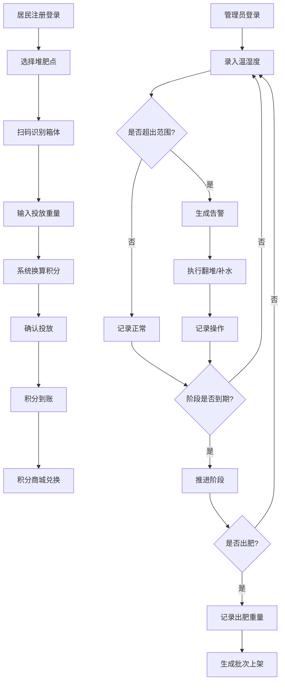

## 1. 产品概述

社区堆肥点管理与有机垃圾回收追踪系统，面向社区堆肥运营方和居民用户，实现堆肥点日常运营管理、居民有机垃圾分类投放积分激励、堆肥过程监控告警与有机肥产出分配的完整闭环。

- 解决社区有机垃圾分散回收难、堆肥运营数据无记录、居民参与缺乏激励的痛点
- 目标用户：社区堆肥管理员、社区物业管理方、社区居民

## 2. 核心功能

### 2.1 用户角色

| 角色 | 注册方式 | 核心权限 |
|------|----------|----------|
| 系统管理员 | 系统预设账号 | 创建/管理堆肥点、配置堆肥箱、管理用户、查看全局数据 |
| 堆肥管理员 | 管理员分配账号 | 记录温湿度/翻堆/出肥、处理告警、管理出肥批次 |
| 居民 | 手机号自主注册 | 扫码投放、查看积分、兑换商品、查看投放记录 |

### 2.2 功能模块

1. **登录注册页**：角色切换登录、居民手机号注册
2. **数据看板**：当日回收总量、累计减碳量、堆肥点运行状态、积分排行、月度投放趋势、多维度筛选
3. **堆肥点管理**：创建/编辑堆肥点、配置堆肥箱（阶段、温湿度范围）、查看运行状态
4. **投放记录**：扫码称重投放、投放明细、积分自动换算
5. **日常监控**：温湿度记录、翻堆操作记录、出肥记录、异常告警
6. **积分商城**：有机肥批次上架、绿植商品、积分兑换
7. **个人中心**：积分余额、投放历史、兑换记录、排行榜

### 2.3 页面详情

| 页面名称 | 模块名称 | 功能描述 |
|----------|----------|----------|
| 登录注册页 | 角色选择 | 管理员/居民角色切换，居民手机号+验证码注册 |
| 数据看板 | 核心指标卡片 | 当日有机垃圾回收总量(kg)、累计减碳量(kg CO₂)、活跃堆肥点数、今日投放人次 |
| 数据看板 | 堆肥点状态列表 | 各堆肥点运行状态（正常/告警/闲置），堆肥箱阶段分布 |
| 数据看板 | 月度投放趋势图 | 按月展示投放重量与次数趋势折线图 |
| 数据看板 | 居民积分排行 | Top 10 居民积分排行榜 |
| 数据看板 | 筛选面板 | 按堆肥点、居民、时间范围筛选统计数据 |
| 堆肥点管理 | 堆肥点列表 | 展示所有堆肥点卡片，含位置、箱体数量、状态标签 |
| 堆肥点管理 | 创建堆肥点 | 填写名称、地址、经纬度、添加堆肥箱 |
| 堆肥点管理 | 堆肥箱配置 | 设置箱体名称、当前阶段、建议温度范围、建议湿度范围 |
| 堆肥点管理 | 阶段流转 | 推进堆肥箱阶段（填充→发酵→腐熟→出肥） |
| 投放记录 | 扫码投放 | 选择堆肥点→扫码识别箱体→输入重量→自动计算积分→确认投放 |
| 投放记录 | 投放明细表 | 按时间倒序展示所有投放记录，含居民、重量、积分、时间 |
| 日常监控 | 温湿度录入 | 选择堆肥箱→录入温度/湿度→自动校验范围→触发告警 |
| 日常监控 | 翻堆记录 | 记录翻堆操作时间、操作人、备注 |
| 日常监控 | 出肥记录 | 记录出肥重量、生成有机肥批次号、自动上架商城 |
| 日常监控 | 告警列表 | 超温/超湿告警卡片，含建议操作（翻堆/补水），确认处理 |
| 积分商城 | 商品列表 | 有机肥批次、绿植商品卡片，含积分价格、库存 |
| 积分商城 | 兑换操作 | 选择商品→确认积分扣除→生成兑换记录 |
| 个人中心 | 积分概览 | 当前积分、累计获得、累计消耗 |
| 个人中心 | 投放历史 | 个人投放记录时间线 |
| 个人中心 | 兑换记录 | 兑换订单列表与状态 |

## 3. 核心流程

### 3.1 居民投放流程
居民登录→选择堆肥点→扫描堆肥箱二维码→系统识别箱体与阶段→输入投放重量→系统按比例换算绿色积分→确认投放→积分到账→可前往商城兑换

### 3.2 堆肥管理员日常监控流程
管理员登录→选择堆肥点→录入各箱体温湿度→系统自动对比阶段建议范围→超范围则生成告警→管理员执行翻堆/补水操作→记录操作→阶段到期推进→出肥时记录重量→生成批次上架商城

### 3.3 流程图

## 4. 用户界面设计

### 4.1 设计风格

- **主色调**：自然绿色系（#2D6A4F 深绿 + #52B788 亮绿），搭配土壤棕（#8B6914）作为辅助色
- **辅助色**：告警橙（#E76F51）、正常绿（#52B788）、闲置灰（#ADB5BD）
- **按钮风格**：圆角（8px），主按钮填充深绿，次要按钮描边
- **字体**：标题使用 Noto Serif SC 衬线体，正文使用 Noto Sans SC
- **布局**：左侧导航栏 + 右侧内容区，卡片式布局
- **图标**：lucide-react 图标库，配合自然/植物主题
- **背景**：浅米色底色（#FAF6F0），搭配细微叶脉纹理

### 4.2 页面设计概览

| 页面名称 | 模块名称 | UI元素 |
|----------|----------|--------|
| 登录注册页 | 整体 | 居中卡片式表单，背景渐变（浅绿到米色），左侧植物装饰插画，输入框带图标前缀，圆角按钮 |
| 数据看板 | 核心指标 | 4个数据卡片横排，深绿渐变背景，数字大号加粗，图标右侧，微动画数字递增 |
| 数据看板 | 趋势图 | 白色卡片容器，绿色折线图，hover显示数据点，月份X轴 |
| 数据看板 | 排行榜 | 紧凑列表，前三名金银铜标记，进度条展示积分比例 |
| 堆肥点管理 | 列表 | 网格卡片布局，每卡片含状态色条（绿/橙/灰），地图标记图标，箱体数量角标 |
| 堆肥点管理 | 创建表单 | 抽屉式侧滑面板，分段表单，堆肥箱动态添加行 |
| 投放记录 | 扫码区 | 大号扫码按钮，扫描线动画，下方快捷选择最近投放点 |
| 日常监控 | 温湿度面板 | 仪表盘样式，圆形进度环显示当前值与范围，绿色正常/橙色超标 |
| 日常监控 | 告警卡片 | 左侧橙色告警条，脉冲动画图标，建议操作按钮 |
| 积分商城 | 商品网格 | 水绿色渐变边框卡片，商品图占上部，下方名称+积分价格+兑换按钮 |
| 个人中心 | 积分概览 | 大号积分数字居中，圆形积分图标，获得/消耗分列两侧 |

### 4.3 响应式设计

- 桌面优先设计，最小宽度 1024px
- 平板适配（768px-1024px）：侧边导航收窄为图标模式，卡片从4列变2列
- 移动端适配（<768px）：底部标签导航，卡片单列堆叠，数据看板横向滚动
