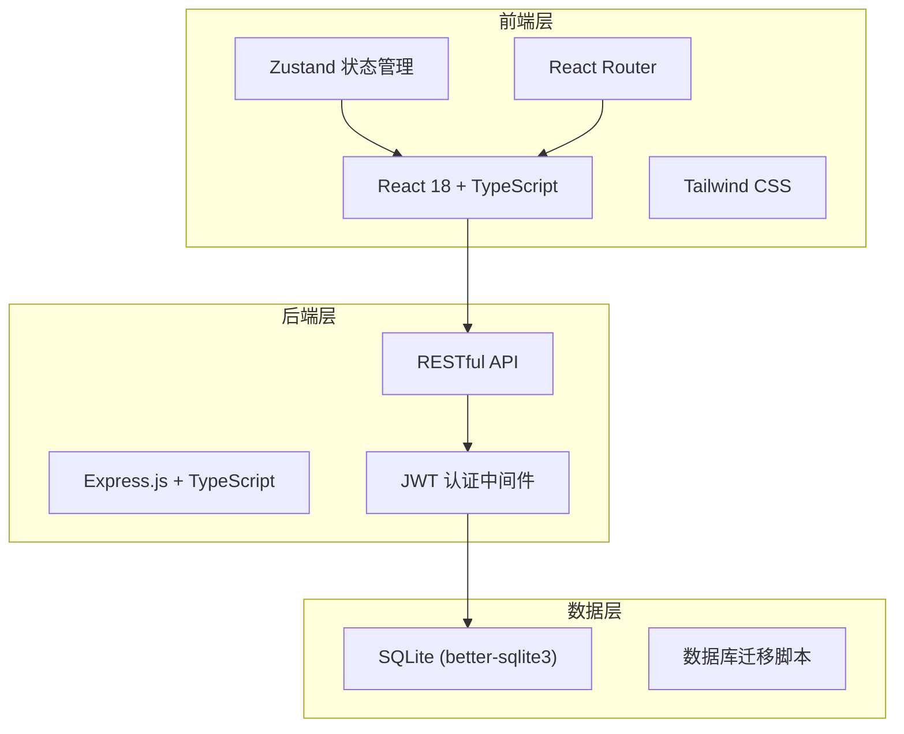
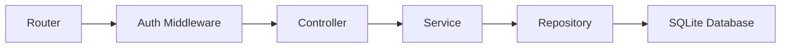
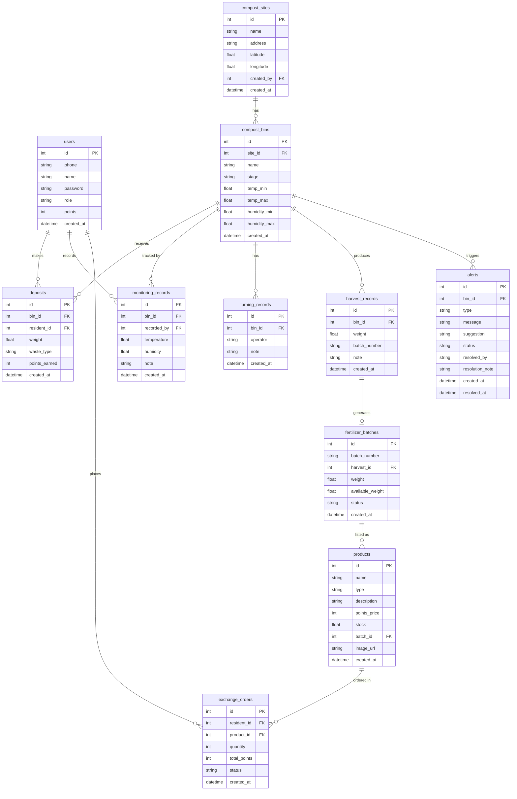

## 1. 架构设计



## 2. 技术说明

- **前端**：React@18 + TypeScript + TailwindCSS@3 + Vite
- **初始化工具**：vite-init (react-express-ts 模板)
- **后端**：Express@4 + TypeScript (ESM)
- **数据库**：SQLite (better-sqlite3)，轻量嵌入式，无需额外服务
- **状态管理**：Zustand
- **路由**：React Router DOM
- **图表**：Recharts
- **图标**：lucide-react
- **认证**：JWT (jsonwebtoken)

## 3. 路由定义

| 路由 | 用途 |
|------|------|
| /login | 登录注册页面 |
| /dashboard | 数据看板主页 |
| /compost-sites | 堆肥点列表与管理 |
| /compost-sites/:id | 堆肥点详情（含堆肥箱配置） |
| /deposit | 扫码投放页面 |
| /deposit/records | 投放记录列表 |
| /monitor | 日常监控面板 |
| /monitor/alerts | 告警中心 |
| /store | 积分商城 |
| /profile | 个人中心 |

## 4. API 定义

### 4.1 认证相关

```typescript
POST /api/auth/register
  body: { phone: string; name: string; password: string }
  response: { token: string; user: User }

POST /api/auth/login
  body: { phone: string; password: string; role: "admin" | "manager" | "resident" }
  response: { token: string; user: User }

GET /api/auth/me
  headers: { Authorization: "Bearer <token>" }
  response: { user: User }
```

### 4.2 堆肥点管理

```typescript
GET /api/compost-sites
  query: { status?: string }
  response: { sites: CompostSite[] }

POST /api/compost-sites
  body: { name: string; address: string; latitude: number; longitude: number; bins: BinConfig[] }
  response: { site: CompostSite }

GET /api/compost-sites/:id
  response: { site: CompostSiteWithBins }

PUT /api/compost-sites/:id
  body: { name?: string; address?: string }
  response: { site: CompostSite }

POST /api/compost-sites/:id/bins
  body: { name: string; stage: BinStage; tempMin: number; tempMax: number; humidityMin: number; humidityMax: number }
  response: { bin: CompostBin }

PUT /api/compost-sites/:siteId/bins/:binId
  body: { stage?: BinStage; tempMin?: number; tempMax?: number; humidityMin?: number; humidityMax?: number }
  response: { bin: CompostBin }

POST /api/compost-sites/:siteId/bins/:binId/advance-stage
  response: { bin: CompostBin }
```

### 4.3 投放记录

```typescript
POST /api/deposits
  body: { binId: number; residentId: number; weight: number; wasteType: "kitchen" | "garden" }
  response: { deposit: Deposit; pointsEarned: number }

GET /api/deposits
  query: { residentId?: number; siteId?: number; startDate?: string; endDate?: string; page?: number }
  response: { deposits: Deposit[]; total: number }
```

### 4.4 日常监控

```typescript
POST /api/monitoring/records
  body: { binId: number; temperature: number; humidity: number; note?: string }
  response: { record: MonitoringRecord; alerts: Alert[] }

POST /api/monitoring/turning
  body: { binId: number; operator: string; note?: string }
  response: { turning: TurningRecord }

POST /api/monitoring/harvest
  body: { binId: number; weight: number; note?: string }
  response: { harvest: HarvestRecord; batch: FertilizerBatch }

GET /api/monitoring/alerts
  query: { siteId?: number; status?: "active" | "resolved" }
  response: { alerts: Alert[] }

PUT /api/monitoring/alerts/:id/resolve
  body: { action: string; note?: string }
  response: { alert: Alert }
```

### 4.5 积分商城

```typescript
GET /api/store/products
  query: { type?: "fertilizer" | "plant" }
  response: { products: Product[] }

POST /api/store/exchange
  body: { productId: number; residentId: number; quantity: number }
  response: { order: ExchangeOrder }

GET /api/store/orders
  query: { residentId?: number }
  response: { orders: ExchangeOrder[] }
```

### 4.6 统计数据

```typescript
GET /api/stats/dashboard
  query: { siteId?: number; residentId?: number; startDate?: string; endDate?: string }
  response: {
    todayWeight: number;
    totalCarbonReduction: number;
    activeSites: number;
    todayDepositors: number;
    siteStatuses: SiteStatus[];
    monthlyTrend: MonthlyData[];
    topResidents: ResidentRanking[];
  }
```

## 5. 服务端架构图



## 6. 数据模型

### 6.1 数据模型定义



### 6.2 数据定义语言

```sql
CREATE TABLE users (
  id INTEGER PRIMARY KEY AUTOINCREMENT,
  phone TEXT NOT NULL UNIQUE,
  name TEXT NOT NULL,
  password TEXT NOT NULL,
  role TEXT NOT NULL CHECK(role IN ('admin', 'manager', 'resident')),
  points INTEGER NOT NULL DEFAULT 0,
  created_at TEXT NOT NULL DEFAULT (datetime('now'))
);

CREATE TABLE compost_sites (
  id INTEGER PRIMARY KEY AUTOINCREMENT,
  name TEXT NOT NULL,
  address TEXT NOT NULL,
  latitude REAL NOT NULL,
  longitude REAL NOT NULL,
  created_by INTEGER NOT NULL REFERENCES users(id),
  created_at TEXT NOT NULL DEFAULT (datetime('now'))
);

CREATE TABLE compost_bins (
  id INTEGER PRIMARY KEY AUTOINCREMENT,
  site_id INTEGER NOT NULL REFERENCES compost_sites(id),
  name TEXT NOT NULL,
  stage TEXT NOT NULL CHECK(stage IN ('filling', 'fermenting', 'maturing', 'harvested')) DEFAULT 'filling',
  temp_min REAL NOT NULL DEFAULT 30,
  temp_max REAL NOT NULL DEFAULT 65,
  humidity_min REAL NOT NULL DEFAULT 40,
  humidity_max REAL NOT NULL DEFAULT 70,
  created_at TEXT NOT NULL DEFAULT (datetime('now'))
);

CREATE TABLE deposits (
  id INTEGER PRIMARY KEY AUTOINCREMENT,
  bin_id INTEGER NOT NULL REFERENCES compost_bins(id),
  resident_id INTEGER NOT NULL REFERENCES users(id),
  weight REAL NOT NULL,
  waste_type TEXT NOT NULL CHECK(waste_type IN ('kitchen', 'garden')),
  points_earned INTEGER NOT NULL,
  created_at TEXT NOT NULL DEFAULT (datetime('now'))
);

CREATE TABLE monitoring_records (
  id INTEGER PRIMARY KEY AUTOINCREMENT,
  bin_id INTEGER NOT NULL REFERENCES compost_bins(id),
  recorded_by INTEGER NOT NULL REFERENCES users(id),
  temperature REAL NOT NULL,
  humidity REAL NOT NULL,
  note TEXT,
  created_at TEXT NOT NULL DEFAULT (datetime('now'))
);

CREATE TABLE turning_records (
  id INTEGER PRIMARY KEY AUTOINCREMENT,
  bin_id INTEGER NOT NULL REFERENCES compost_bins(id),
  operator TEXT NOT NULL,
  note TEXT,
  created_at TEXT NOT NULL DEFAULT (datetime('now'))
);

CREATE TABLE harvest_records (
  id INTEGER PRIMARY KEY AUTOINCREMENT,
  bin_id INTEGER NOT NULL REFERENCES compost_bins(id),
  weight REAL NOT NULL,
  batch_number TEXT NOT NULL,
  note TEXT,
  created_at TEXT NOT NULL DEFAULT (datetime('now'))
);

CREATE TABLE fertilizer_batches (
  id INTEGER PRIMARY KEY AUTOINCREMENT,
  batch_number TEXT NOT NULL UNIQUE,
  harvest_id INTEGER NOT NULL REFERENCES harvest_records(id),
  weight REAL NOT NULL,
  available_weight REAL NOT NULL,
  status TEXT NOT NULL CHECK(status IN ('available', 'depleted')) DEFAULT 'available',
  created_at TEXT NOT NULL DEFAULT (datetime('now'))
);

CREATE TABLE products (
  id INTEGER PRIMARY KEY AUTOINCREMENT,
  name TEXT NOT NULL,
  type TEXT NOT NULL CHECK(type IN ('fertilizer', 'plant')),
  description TEXT,
  points_price INTEGER NOT NULL,
  stock REAL NOT NULL,
  batch_id INTEGER REFERENCES fertilizer_batches(id),
  image_url TEXT,
  created_at TEXT NOT NULL DEFAULT (datetime('now'))
);

CREATE TABLE exchange_orders (
  id INTEGER PRIMARY KEY AUTOINCREMENT,
  resident_id INTEGER NOT NULL REFERENCES users(id),
  product_id INTEGER NOT NULL REFERENCES products(id),
  quantity INTEGER NOT NULL,
  total_points INTEGER NOT NULL,
  status TEXT NOT NULL CHECK(status IN ('pending', 'completed', 'cancelled')) DEFAULT 'pending',
  created_at TEXT NOT NULL DEFAULT (datetime('now'))
);

CREATE TABLE alerts (
  id INTEGER PRIMARY KEY AUTOINCREMENT,
  bin_id INTEGER NOT NULL REFERENCES compost_bins(id),
  type TEXT NOT NULL CHECK(type IN ('high_temp', 'low_temp', 'high_humidity', 'low_humidity')),
  message TEXT NOT NULL,
  suggestion TEXT NOT NULL,
  status TEXT NOT NULL CHECK(status IN ('active', 'resolved')) DEFAULT 'active',
  resolved_by TEXT,
  resolution_note TEXT,
  created_at TEXT NOT NULL DEFAULT (datetime('now')),
  resolved_at TEXT
);

CREATE INDEX idx_deposits_bin ON deposits(bin_id);
CREATE INDEX idx_deposits_resident ON deposits(resident_id);
CREATE INDEX idx_deposits_created ON deposits(created_at);
CREATE INDEX idx_monitoring_bin ON monitoring_records(bin_id);
CREATE INDEX idx_monitoring_created ON monitoring_records(created_at);
CREATE INDEX idx_alerts_bin ON alerts(bin_id);
CREATE INDEX idx_alerts_status ON alerts(status);
CREATE INDEX idx_compost_bins_site ON compost_bins(site_id);
